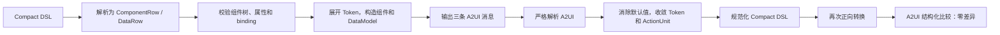

# CreateMyCard 正逆向转换器实现逻辑

## 1. 先看完整例子

用一张“今日天气”卡片贯穿整个过程。它包含：

- Text Design Token；
- Progress Design Token；
- 颜色 Token；
- 数据 path binding；
- 事件参数 binding；
- icon-round ActionUnit；
- 完整 DataModel。



对应代码：

- 正向：[compact_dsl_a2ui_converter.py](../../frameworks/verl/create_my_card/data_pipeline/converters/compact_dsl_a2ui_converter.py)
- 逆向与 roundtrip：[reverse_and_verify.py](../../frameworks/verl/create_my_card/data_pipeline/converters/reverse_and_verify.py)

## 2. 示例输入：Design Compact DSL

```jsonl
["root","Column",{"width":160,"height":160,"backgroundColor":"background_primary"},["title","progress","action"]]
["title","Text",{"content":{"path":"/card/title"},"design":"card-title","fontColor":"font_primary"}]
["progress","Progress",{"value":{"path":"/card/progress"},"total":100,"design":"linear-bar","color":"multi_color_02"}]
["action","ActionUnit",{"state":"icon-round","icon":"resources/base/media/refresh.svg","onClick":[{"call":"refreshCard","args":{"cardId":{"path":"/card/id"}}}]}]
["/",{"card":{"id":"weather-001","title":"今日天气","progress":72}}]
```

这五行不是 A2UI 消息：前四行描述组件，最后一行描述数据。

## 3. 正向转换：Compact DSL → A2UI

主入口是 `convert_compact_dsl_to_a2ui()`。可以把它理解为一个小型编译器：先解析成内部结构，再校验、展开和输出，而不是边读一行边拼 A2UI。

### 3.1 从文本中提取完整数组

`_extract_top_level_array_rows()` 逐字符扫描输入，维护：

```text
当前是否处于字符串中
字符串中的转义状态
尚未闭合的 ] 或 }
```

所以无论数组写成单行还是跨行，都能提取为一条完整 Row；同时可以发现未闭合字符串、括号错配、尾部多余符号和数组之间的解释文字。

示例经过这一步后得到五个 JSON 数组字符串，再分别执行 `json.loads()`。

### 3.2 解析为内部中间结构

`_parse_row()` 根据数组形状，将示例解析为两种对象：

```python
ComponentRow(
    component_id="root",
    component_type="Column",
    props={
        "width": 160,
        "height": 160,
        "backgroundColor": "background_primary",
    },
    children=("title", "progress", "action"),
)

ComponentRow(
    component_id="title",
    component_type="Text",
    props={
        "content": {"path": "/card/title"},
        "design": "card-title",
        "fontColor": "font_primary",
    },
    children=(),
)

ComponentRow(
    component_id="progress",
    component_type="Progress",
    props={
        "value": {"path": "/card/progress"},
        "total": 100,
        "design": "linear-bar",
        "color": "multi_color_02",
    },
    children=(),
)

ComponentRow(
    component_id="action",
    component_type="ActionUnit",
    props={...},
    children=(),
)

DataRow(
    path="/",
    value={
        "card": {
            "id": "weather-001",
            "title": "今日天气",
            "progress": 72,
        }
    },
)
```

内部结构把“组件”和“数据”明确分开，后续分别构造 `updateComponents` 和 `updateDataModel`。

### 3.3 组件树、属性和 binding 校验

`_validate_component_tree()` 从 root 的 children 关系重建前序组件树：

```text
root/Column
├── title/Text
├── progress/Progress
└── action/ActionUnit
```

在本例中会验证：

- root ID 为 `root`，类型为 Column；
- `title`、`progress`、`action` 都有定义；
- 每个组件只有一个父节点；
- 没有重复 ID、环、孤儿组件和悬空 children；
- Text 存在 `content`；
- Progress 存在 `value` 和 `total`；
- ActionUnit 存在合法 state、icon 和 onClick；
- 素材路径以 `resources/base/media/` 开头；
- `fontColor`、`color`、尺寸等属性属于对应组件白名单且类型正确。

接着 `_validate_binding_paths()` 收集示例中的三个 path：

```text
/card/title
/card/progress
/card/id
```

它们必须全部存在于 DataRow 构造出的 DataModel 中。任何一个路径不存在，转换都会在构造最终消息前失败。

### 3.4 展开 Design Token 和颜色 Token

`_normalize_component()` 先执行 Design 展开，再递归解析颜色 Token。

#### title

输入：

```json
{
  "content":{"path":"/card/title"},
  "design":"card-title",
  "fontColor":"font_primary"
}
```

查 `_COMPONENT_DESIGNS["Text"]["card-title"]`：

```json
{
  "fontSize":14,
  "fontWeight":700
}
```

再把 `font_primary` 转为 Hex，得到规范化 props：

```json
{
  "content":{"path":"/card/title"},
  "fontSize":14,
  "fontWeight":700,
  "fontColor":"#E5000000"
}
```

#### progress

`linear-bar` 展开为：

```json
{
  "type":"linear",
  "width":"matchParent",
  "height":8,
  "borderRadius":4,
  "backgroundColor":"#19000000"
}
```

显式的 `color:"multi_color_02"` 再展开成：

```json
{"color":"#FF46B1E3"}
```

Design Token 定义默认值，Compact 中显式属性具有更高优先级。

### 3.5 构造 DataModel

`_build_data_model()` 按 JSON Pointer 把所有 DataRow 写入一棵对象树。本例的根 DataRow 直接得到：

```json
{
  "card":{
    "id":"weather-001",
    "title":"今日天气",
    "progress":72
  }
}
```

如果使用多行数据也会合并到同一棵树，例如：

```jsonl
["/card/title","今日天气"]
["/card/progress",72]
```

同一路径出现不同值、对象与标量冲突或数组下标冲突时直接报错。

### 3.6 构造普通 A2UI 组件

`_convert_component()` 先创建：

```json
{"id":"title","component":"Text"}
```

然后遍历规范化 props，并按属性语义分流：

```text
Text.content、Image.src、Progress.value/total → 组件外层
onClick                                  → 组件外层
Row/Column.itemMargin、List.space        → 组件外层
其余视觉和布局属性                        → styles
```

binding 在这个阶段递归转换：

```text
{"path":"/card/title"}
→ {{ ${/card/title} }}
```

所以 title 最终构造成：

```json
{
  "id":"title",
  "component":"Text",
  "content":"{{ ${/card/title} }}",
  "styles":{
    "fontSize":14,
    "fontWeight":700,
    "fontColor":"#E5000000",
    "maxLines":1
  }
}
```

其中 `maxLines:1` 是正向器为未显式设置 maxLines 的 Text 补充的默认值。

### 3.7 ActionUnit 会展开成两个组件

示例中的：

```json
["action","ActionUnit",{
  "state":"icon-round",
  "icon":"resources/base/media/refresh.svg",
  "onClick":[{
    "call":"refreshCard",
    "args":{"cardId":{"path":"/card/id"}}
  }]
}]
```

由 `_convert_action_unit_icon_round()` 展开成：

```json
{
  "id":"action",
  "component":"Stack",
  "children":["action_icon"],
  "onClick":[{
    "call":"refreshCard",
    "args":{"cardId":"{{ ${/card/id} }}"}
  }],
  "styles":{
    "width":30,
    "height":30,
    "borderRadius":15,
    "padding":0,
    "backgroundColor":"#0C000000",
    "flexShrink":0,
    "alignContent":"center",
    "clip":true
  }
}
```

以及一个自动生成的 Image：

```json
{
  "id":"action_icon",
  "component":"Image",
  "src":"resources/base/media/refresh.svg",
  "styles":{
    "width":16,
    "height":16,
    "objectFit":"contain",
    "flexShrink":0
  }
}
```

因此一个 Compact 组件可能输出多个 A2UI 组件，代码使用 `extend()` 收集转换结果。

### 3.8 root 默认壳处理

示例是 2x2 卡片。`_normalize_root_component()` 将 root 数值宽高用于尺寸校验，但最终组件样式输出：

```json
{
  "width":"matchParent",
  "height":"matchParent",
  "backgroundColor":"#FFFFFFFF",
  "padding":12,
  "borderRadius":20,
  "clip":true,
  "justifyContent":"spaceBetween"
}
```

同时在组件外层补：

```json
{"itemMargin":8}
```

本例显式提供了背景色。没有背景时，正向器会根据 Compact 全文 SHA-256 稳定选择一套渐变，不使用随机值。

### 3.9 组装三条 A2UI 消息

到这一步，内存里已经得到：

```text
surface_dimensions   = 160×160
converted_components = 5 个 A2UI 组件
data_model            = card 数据对象
```

主入口统一组装三个字典：

```python
messages = [
    {
        "version": "v0.9",
        "createSurface": {
            "surfaceId": "surface_card",
            "catalogId": "ohos.a2ui.extended.catalog.form",
            "width": 160,
            "height": 160,
        },
    },
    {
        "version": "v0.9",
        "updateComponents": {
            "surfaceId": "surface_card",
            "root": "root",
            "components": converted_components,
        },
    },
    {
        "version": "v0.9",
        "updateDataModel": {
            "surfaceId": "surface_card",
            "path": "/",
            "value": data_model,
        },
    },
]
```

最后 `_serialize_rows()` 对每个字典执行紧凑 `json.dumps()`，用换行连接，不添加最外层数组。

本例实际输出为：

```jsonl
{"version":"v0.9","createSurface":{"surfaceId":"surface_card","catalogId":"ohos.a2ui.extended.catalog.form","width":160,"height":160}}
{"version":"v0.9","updateComponents":{"surfaceId":"surface_card","root":"root","components":[{"id":"root","component":"Column","children":["title","progress","action"],"itemMargin":8,"styles":{"width":"matchParent","height":"matchParent","backgroundColor":"#FFFFFFFF","padding":12,"borderRadius":20,"clip":true,"justifyContent":"spaceBetween"}},{"id":"title","component":"Text","content":"{{ ${/card/title} }}","styles":{"fontSize":14,"fontWeight":700,"fontColor":"#E5000000","maxLines":1}},{"id":"progress","component":"Progress","value":"{{ ${/card/progress} }}","total":100,"styles":{"type":"linear","width":"matchParent","height":8,"borderRadius":4,"backgroundColor":"#19000000","color":"#FF46B1E3"}},{"id":"action","component":"Stack","children":["action_icon"],"onClick":[{"call":"refreshCard","args":{"cardId":"{{ ${/card/id} }}"}}],"styles":{"width":30,"height":30,"borderRadius":15,"padding":0,"backgroundColor":"#0C000000","flexShrink":0,"alignContent":"center","clip":true}},{"id":"action_icon","component":"Image","src":"resources/base/media/refresh.svg","styles":{"width":16,"height":16,"objectFit":"contain","flexShrink":0}}]}}
{"version":"v0.9","updateDataModel":{"surfaceId":"surface_card","path":"/","value":{"card":{"id":"weather-001","title":"今日天气","progress":72}}}}
```

## 4. 逆向转换：A2UI → 规范化 Compact DSL

逆向入口 `convert_a2ui_to_compact_dsl()` 不尝试猜出原始 Compact 文本，而是从最终 A2UI 生成一个能再次正向得到同等 A2UI 的规范化中间态。

### 4.1 严格解析三条 A2UI 消息

`parse_a2ui()` 逐行执行 `json.loads()`，根据 payload key 分别收集：

```text
createSurface
updateComponents
updateDataModel
```

本例会验证：

- 三种消息各出现一次；
- 三条消息 version 均为 `v0.9`；
- 三条消息 surfaceId 均为 `surface_card`；
- catalogId 正确；
- updateComponents.root 为 `root`；
- updateDataModel.path 为 `/`；
- 每个组件只含协议允许的外层字段和 styles；
- 组件树无环、无多父节点、无缺失或不可达组件。

解析后组件树为：

```text
root/Column
├── title/Text
├── progress/Progress
└── action/Stack
    └── action_icon/Image
```

### 4.2 普通组件恢复为 Compact props

`_reverse_regular_component()` 把 A2UI 外层语义字段和 `styles` 重新合并。

title 先恢复为：

```json
{
  "content":{"path":"/card/title"},
  "fontSize":14,
  "fontWeight":700,
  "fontColor":"#E5000000",
  "maxLines":1
}
```

其中：

```text
{{ ${/card/title} }}
→ {"path":"/card/title"}
```

事件 args 中的：

```text
{{ ${/card/id} }}
→ {"path":"/card/id"}
```

也通过同一个递归 binding 逆向逻辑恢复。

### 4.3 删除正向必然生成的默认值

逆向器知道正向器必然生成了哪些字段，因此将它们恢复为 Compact 侧的规范形式：

| A2UI 中的值 | 逆向处理 |
| --- | --- |
| root `width/height:"matchParent"` | 恢复为 `width:160,height:160` |
| root `padding:12` | 删除 |
| root `borderRadius:20` | 删除 |
| root `clip:true` | 删除 |
| root 外层 `itemMargin:8` | 删除 |
| root `justifyContent:"spaceBetween"` | 作为默认值删除 |
| Text `maxLines:1` | 作为默认值删除 |

如果源 A2UI 中这些必然字段缺失或取值不同，逆向会失败，因为再次正向后不可能保持等效。

### 4.4 收敛 Design Token

title 删除 `maxLines:1` 后包含：

```json
{
  "content":{"path":"/card/title"},
  "fontSize":14,
  "fontWeight":700,
  "fontColor":"#E5000000"
}
```

`_collapse_design()` 遍历 Text Design Token，发现 `card-title` 定义的字段全部匹配：

```json
{"fontSize":14,"fontWeight":700}
```

于是删除这两个显式字段，写入：

```json
{
  "content":{"path":"/card/title"},
  "design":"card-title",
  "fontColor":"#E5000000"
}
```

Progress 同理收敛回 `design:"linear-bar"`，显式进度颜色继续保留。

颜色 Token 逆向默认关闭，所以 `#E5000000` 和 `#FF46B1E3` 不会默认恢复成原来的 Token 名。这避免同一 Hex 对应多个颜色别名时进行不必要的语义猜测。

### 4.5 严格识别 ActionUnit

`_match_icon_round_action_unit()` 检查本例中的 action/Stack：

```text
外层字段集合完全匹配
组件类型是 Stack
唯一 child 是 action_icon
Stack 样式与正向 icon-round 模板完全一致
action_icon 是 Image
Image 字段和固定样式完全一致
src 是合法本地素材
```

全部满足后，将两个 A2UI 组件重新收敛成一条：

```json
["action","ActionUnit",{
  "state":"icon-round",
  "icon":"resources/base/media/refresh.svg",
  "onClick":[{
    "call":"refreshCard",
    "args":{"cardId":{"path":"/card/id"}}
  }]
}]
```

如果任意结构或样式不一致，就按普通 Stack 和 Image 保留，不会仅凭外观猜成 ActionUnit。

### 4.6 DataModel 恢复为根 DataRow

逆向器不拆散源 DataModel，而是将完整对象写成一条根数据行：

```json
["/",{
  "card":{
    "id":"weather-001",
    "title":"今日天气",
    "progress":72
  }
}]
```

这可以无损保留未被组件直接使用但仍属于最终 A2UI 的数据。

### 4.7 示例的规范化逆向结果

```jsonl
["root","Column",{"backgroundColor":"#FFFFFFFF","height":160,"width":160},["title","progress","action"]]
["title","Text",{"content":{"path":"/card/title"},"design":"card-title","fontColor":"#E5000000"}]
["progress","Progress",{"color":"#FF46B1E3","design":"linear-bar","total":100,"value":{"path":"/card/progress"}}]
["action","ActionUnit",{"icon":"resources/base/media/refresh.svg","onClick":[{"args":{"cardId":{"path":"/card/id"}},"call":"refreshCard"}],"state":"icon-round"}]
["/",{"card":{"id":"weather-001","progress":72,"title":"今日天气"}}]
```

它与原始 Compact DSL 不逐字相同，主要差异是：

| 原始写法 | 规范化逆向写法 | 原因 |
| --- | --- | --- |
| `background_primary` | `#FFFFFFFF` | Hex →颜色 Token 默认关闭 |
| `font_primary` | `#E5000000` | 同上 |
| `multi_color_02` | `#FF46B1E3` | 同上 |
| JSON 属性原始顺序 | key 排序后的顺序 | 保证确定性序列化 |

组件树、Design Token、binding、事件、DataModel 和有效样式没有改变。

## 5. Roundtrip 如何确认等效

`reverse_and_verify()` 对上面的规范化 Compact DSL 再次调用同一个正向转换器：

```text
规范化 Compact DSL
→ 展开 Design Token
→ Hex 原样保留
→ ActionUnit 再次展开
→ 得到 roundtrip A2UI
```

比较前，source 和 roundtrip 两边只做确定性规范化：

- 组件按树前序排列；
- 兼容输入缺少 Surface 宽高时按已确认 size 补齐；
- onClick 内的结构化 binding 统一成最终字符串。

然后递归比较字典、数组和标量。差异类型只有：

```text
added
removed
changed
```

本例报告的核心结果：

```json
{
  "caseId":"demo",
  "size":"2x2",
  "reverse":"pass",
  "compactValidation":"pass",
  "contextValidation":"not_run",
  "forward":"pass",
  "roundtrip":"pass",
  "differences":[],
  "warnings":[]
}
```

这说明：

```text
forward(reverse(source A2UI))
== source A2UI（规范化后）
```

而不是：

```text
reverse(forward(original Compact))
== original Compact 原文
```

## 6. 从例子归纳出的实现原则

1. **先解析为内部结构，再构造输出**：Compact 文本不会被直接拼接为 A2UI。
2. **组件和数据分开处理**：ComponentRow 构造组件，DataRow 构造 DataModel。
3. **Token 只负责确定性展开和收敛**：不调用模型，不猜测设计意图。
4. **Binding 必须与 DataModel 闭合**：路径没有数据值就不允许输出。
5. **ActionUnit 是结构级语义组件**：正向一对多展开，逆向严格匹配后多对一收敛。
6. **逆向结果必须再次通过正向器**：不是只生成看起来合理的 Compact DSL。
7. **验收最终 A2UI 等效**：不要求恢复 Token 别名、key 顺序和默认字段的原始写法。

## 7. 输入兼容层放在什么位置

在示例第 3.2 步解析 ComponentRow 时，转换器会先把明确登记的兼容写法归一成标准 Compact 属性，再进入严格校验：

| 兼容输入 | 规范形式 |
| --- | --- |
| `flexGrow` | `layoutWeight` |
| width/height 的 `100%`、`stretch` | `matchParent` |
| Row/Column 的 `space` | `itemMargin` |
| List 的 `itemMargin` | `space` |
| `space-between` | `spaceBetween` |
| Text 的 `value` 或 `text` | `content` |
| `Ring` | `Progress + design:"ring"` |
| onClick 对象或二元组 | 标准处理器数组 |
| 明确历史 binding 对象 | `{"path":"/..."}` |

这层只做固定映射，不补造 label、事件、素材或业务数据。用于训练的标签仍应直接采用规范形式。

## 8. 当前可执行协议边界

| 项目 | 当前实现 |
| --- | --- |
| Compact 组件 | Row、Column、List、Stack、Text、Image、Divider、Progress、Button、ActionUnit、Checkbox，共 11 种 |
| 根节点 | ID 必须为 `root`，类型必须为 `Column` |
| Design Token | 32 个：Text 18、Image 3、Button 2、Progress 5、Divider 2、Checkbox 2 |
| 颜色 Token | 55 个 Token 名，对应 35 个唯一 Hex 值 |
| 尺寸 | `2x2=160×160`、`2x4=320×160`、`4x2=320×160` |
| A2UI 消息 | createSurface、updateComponents、updateDataModel 各一条 |
| Binding | JSON Pointer path 与受限 expression |

`2x4` 和 `4x2` 的像素尺寸相同，逆向时仅靠 Surface 无法区分，必须显式提供 size 或从 TaskSpec/CardSpec 获取。

## 9. 汇报时可直接使用的表述

> 以天气卡为例，正向转换器先把五行极简 DSL 解析成四个 ComponentRow 和一个 DataRow，验证 root 组件树以及三个数据绑定，再展开 title 和 progress 的 Design Token、颜色 Token，并把 ActionUnit 展开成 Stack 和 Image，最后用尺寸、组件列表和 DataModel 统一组装三条 A2UI 消息。逆向时先严格解析这三条消息，恢复 binding，删除 root 和 Text 的生成默认值，对完整匹配的样式收敛回 Design Token，对严格匹配的 Stack+Image 收敛回 ActionUnit，生成规范化极简 DSL。这个中间态会立即再次正向转换，与源 A2UI 做结构化比较；零差异才算通过。

维护时应把两个转换器视为同一个版本单元。修改组件白名单、Design Token、颜色表、默认值、ActionUnit 展开结构或 binding 语法后，需要重新执行目标数据集的全量 roundtrip。

当前文件指纹：

```text
compact_dsl_a2ui_converter.py
SHA-256 0389E1EC34903BBDD1FA9FD3F9AF67266E21A6AB8D84D36304D0958B5B4C341A

reverse_and_verify.py
SHA-256 5698878D07E40BA41D0420FEE966385169D7107237EE5A835824DA447D4B2FD5
```
